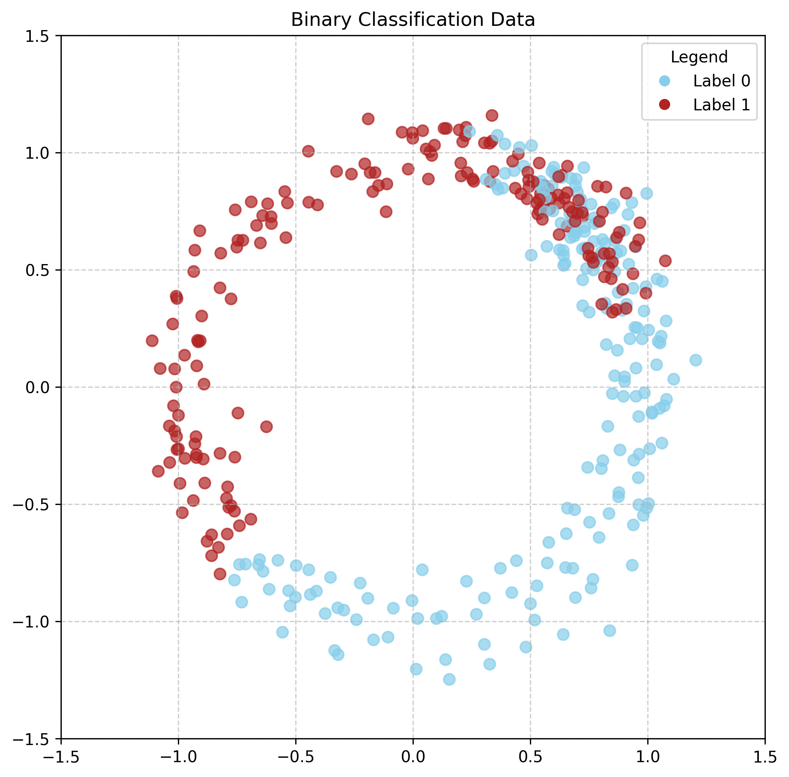

## Training Fair Models That Affect Their Data

The way models classically work is you have training data, you train your model on said data, then you deploy the model into the real world. The assumption is whatever data you use to train your data will be an accurate representation of what the model will see in the real world (i.e., identically distributed). What happens if this isn't the case? Worse, what happens if the action of deploying the model is explicitly what causes the real world to be different from its training data? How do we get around this? How can we train our models to be more efficient in these situations? 

This problem becomes even more critical when we consider fairness. Many models are trained to perform well on average cases, which can lead them to ignore or underperform on minority groups within the data. These biases don't just affect model performance; they can be actively reinforced when the model's decisions influence future data. For example, a loan approval model that performs worse for minority groups might reject more applications from these groups unjustly, leading to worse financial outcomes and reinforcing the very disparities present in the training data.

My current research looks to solve this problem. Here's the journey I'm going to take you on,

1. Performative Prediction 
    - When models change their data
2. Distributionally Robust Optimization
    - Making models robust to changes
3. Combining the two
    - Training fair models that affect their data

### 1. Performative Prediction
Okay first, what is performative prediction. As we are all aware, machine learning (ML) models are being used more widely than ever for decisions in almost all areas of life. Whether it's in analyzing medical images[1], fraud-detection[2], or credit risk[2], machine learning is taking more and more precedence in our lives. As these models start making decisions on increasingly more important data, and larger institutions start using them, we face the very real problem of the models making decisions that influence the outcome they are trying to predict. This is called *performative prediction*.

As a dummy example to allow us to build intuition, lets look at binary classification. Let's assume we are analyzing the following data, 

Here we are looking to separate the blue circles from the red circles. In the real world this might represent spam detection, where the red circles are spam mail and the blue circles are not. As an initial guess we might first start with a model estimate as so,

Clearly this is not the best guess. To see how we can change our model, we can first evaluate the (log) loss on this current guess, then try performing a small rotation on it clockwise and counterclockwise to see if the model's loss goes up or down (gradient descent) and follow the direction that decreases the loss. Let's see it in this example. 

Here we notice the loss decreases if we rotate our guess counterclockwise, and so we follow this and repeat the process until we have our best model as shown below. 

Great! Up until this point we have done *classical machine learning*. Nothing so far has anything to do with models affecting their data or performative prediction. So let's consider that possibility. First notice that the data is actually made up of two distinct groups: 

These two groups could represent a variety of things, perhaps visible minorities and non-minorities, perhaps male and female, etc. Here in the spam example we might consider group A to be groups that are not able to change the content of their mail, while group B is. Maybe group B is better capable at confiscating their intention. Regardless, in response to the models deployment, and its successful ability at classifying spam versus not spam, we may suspect the spam mailers to change the content of their mail in response to the model to avoid detection. For example, notice that the spam points of group B are normally distributed around θ = π/4, which happens to correspond pretty closely to our models line.

Hence, we might expect to see a *shift* in the distribution of group B. That is, maybe the spam mailers might change how they send their mail and we could see them become normally distributed around say θ = 3π/16, i.e.,

*Insert image of the group shifting by a bit*

Now if we were to re-evaluate our current best model, we might see that our loss has increased. That is, the real world data responded to our model, leading to our model performing worse. This is showcased below. 

Hence, it is clear that this game of cat and mouse under certain conditions can go on forever, but however, under other conditions we can get some nice behaviors. Perdomo et. al[3] cover this in their 2021 paper. To discuss their results we have to give a couple of definitions and get a bit technical. 

 
First, after a *distribution* changes, the new trained model is considered to be **performatively optimal**, if it's the best model under this new distribution. In math terms we have, 
$$
    \theta_{PO} = \text{argmin}_{\theta} \mathbb{E}_{Z\sim D(\theta)}\ell (Z;\theta).
$$
Basically, as stated, this performatively optimal model is the one that's best under the new distribution. **Performatively stable** is slightly different. This means that it's the best model under the current change, and it's the best model *after* the data is affected by the deployment of the model. Essentially this is a place where the model and data converge. So now the question becomes, when does retraining lead to converges to stable points. 

Here we have a few more definitions we have to go through. First we consider $D: \Theta \to P(\Xi)$ to be what's called a distribution map. Essentially this is what shifts the distribution after the model is deployed. The first condition is fairly intuitive. We need the distribution to be $\epsilon$-sensitive. In math notation this is
$$
    W_1(D_(\theta), D(\theta^{\prime})) \le \epsilon \|\theta - \theta^{\prime} \|_2.
$$

What this means is that we require the distribution map to shrink the potential distributions we might see every time we deploy the model. The reason we want this is so that the group of distributions gets smaller and smaller and so then we can have convergence. 

*Insert image showcasing contraction mappings*

The next two conditions are called $\beta$-jointly smooth and $\gamma$-strongly convex. If you thought the previous definitions were technical these are more, and so I will be omitting them here. However, the main idea is again, we want these contraction conditions. These ideas are important to note that they are 
1. Parameterized by $\beta$, $\gamma$
2. They are heavily involved in providing contraction conditions that allow for convergence

Now the main result is that if we have the above contraction conditions and $\epsilon < \frac{\gamma}{\beta}$, then the model will converge to a performatively stable point $\theta_{PS}$ at a linear rate.

#### Takeaways
That was a lot of math and a lot of ideas. What are the main takeaways? 
- Models can affect their data messing up the models
- If the models and their data have specific contraction conditions ($\epsilon < \frac{\gamma}{\beta}$) then they converge

### 2. Distributionally Robust Optimization
So now there is a main problem we look to address.
- What if minority groups change differently than the majority? If the data is sensitive (banking, medical, etc.) fairness could be really important in this case and significantly effected.

To address this problem we use a new technical tool called Distributionally Robust Optimization. Here's the main idea. Remember the space of probabilities we were discussing before,

*Insert picture of probability distributions in a bubble*

What if instead of optimizing over $P_0$, our initial distribution, waiting for the distribution to change, then optimizing over the changed distribution, we optimized over the worse case in a bubble around $P_0$ of distributions we think we would likely see. That is, when evaluating our guess, instead of doing as before and calculating the loss on the one scenario, we look at all 'nearby possible' scenarios and calculate the loss there. Then we try to minimize the worse case possible scenario and train accordingly. The idea is the model should already be prepared for any shifts, and still be performing well for any minority groups that are considered. 

*Insert image showcasing training*

Now lets look at example. This example is given to us by Pare [4] in his 2022 thesis. Here he considers a similar example as we covered in the first section, 

*Insert image of the data set*

Again, this data set is made of two groups,

*Insert image of the two data sets*

When he then trains the decision boundary using ERM (basically classical machine learning) and DRO, he gets the following results,

*Insert images of the results*

As you can see, the ERM case does better on average, specifically in group A, however underperforms for group B. Comparatively, DRO also under performs for group B, but it sacrifices its performance on group A to make this underperformance *less drastic*, thereby keeping its performance *more fair*. 

### 3. Combining the Two: Performative DRO

So now that we have explained Performative Prediction and DRO, let's look at how we can combine the two. Again Pare [4] explores this topic, and gives a condition for convergence. To recall, for classical performative prediction we required
1. $\epsilon$-sensitive distribution map, and the loss function to be $\beta$-jointly smooth and $\gamma$-strongly convex. We called these **contraction conditions**
2. We required $\epsilon < \frac{\gamma}{\beta}$.

Similarly, Pare found that to have convergence in the robust (i.e., DRO) setting, we need
1. *robust* $\omega \epsilon$-sensitive distribution map *insert footnote that this is a bit different*, the loss function to be *robust* $\beta$-jointly smooth and *robust* $\gamma$-strongly convex
2. We require $\omega \epsilon < \frac{\gamma}{\beta}$.

At first glance, these conditions look nearly identical to the previous, and by construction they in fact are. However, when you get into the mathematical weeds of it, its more clear if the contraction conditions in the classical performative prediction case are satisfied than it is for the robust performative prediction situation. This is because It's not quite as obvious conditions such as smoothness and convexity would be retained when we take the maximum of the loss over a set of distributions, which is precisely the robust case. This brings up the main concern which is what (softer) conditions actually lead to these robust contraction conditions. Are they reasonable? Can we actually expect to see them in practice? That brings us to our final section.

### 4. Conclusion and Future Work
We discussed performative prediction, studying models when they affect their data. Distributionally Robust Optimization, which is training models on the worse case so that they lead to more fair outcomes on the data they are trained on. Finally, we discussed Performative Distributionally Robust Optimization, which is when we use DRO in performative prediction settings to have models converge on more fair solutions. We mentioned certain contraction conditions that are required to have this fair and robust convergence occur, and the exploration for how reasonable they really are. My current work is to explore what more generalized and reasonable conditions I can have to ensure robust convergence, specifically the main questions I have are as follows,

1. We need robust $\beta$-joint smoothness from $\beta$-joint smoothness. What conditions when taking the max of a set of functions give us continuity? Differentiability? Smoothness? Joint smoothness? 
2. What conditions are needed on the set and the mapping to retain $\gamma$-strong convexity into robust $\gamma$-strong convexity?
3. What needs to be added to turn $\epsilon$-sensitive into $\omega \epsilon$-sensitive?

I hope to explore these ideas by looking into convex analysis, functional analysis, non-smooth analysis, and by reading the current literature on DRO. Specifically how it has been used in other contexts and how theorems have been proven in those situations. 

Thank you for reading this long paper. I hope you enjoyed. If you have any comments or wish to discuss mathematics please email me at smetwall@ualberta.ca!

### References

**[1]** Alowais, S. A., et al. (2023). Revolutionizing healthcare: the role of artificial intelligence in clinical practice. BMC Medical Education, 23(1), 689. <a href="https://doi.org/10.1186/s12909-023-04698-z">https://doi.org/10.1186/s12909-023-04698-z</a>

**[2]** Vidovic, L., & Yue, L. (2020). Machine Learning and Credit Risk Modelling. S&P Global Market Intelligence. White Paper.
 